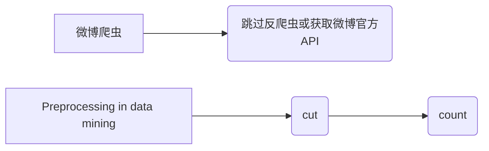

[微博文本情感分析地址](https://github.com/Zephery/weiboanalysis)

## 架构

```mermaid
graph LR
	0[微博爬虫] --> a(跳过反爬虫或获取微博官方API)
	1[Preprocessing in data mining] --> b
    b(cut) -->c(count)
		
```

1. 首先是爬虫爬取文本，在另一个项目中
2. 然后数据预处理，分词、词频统计、相似度计算

